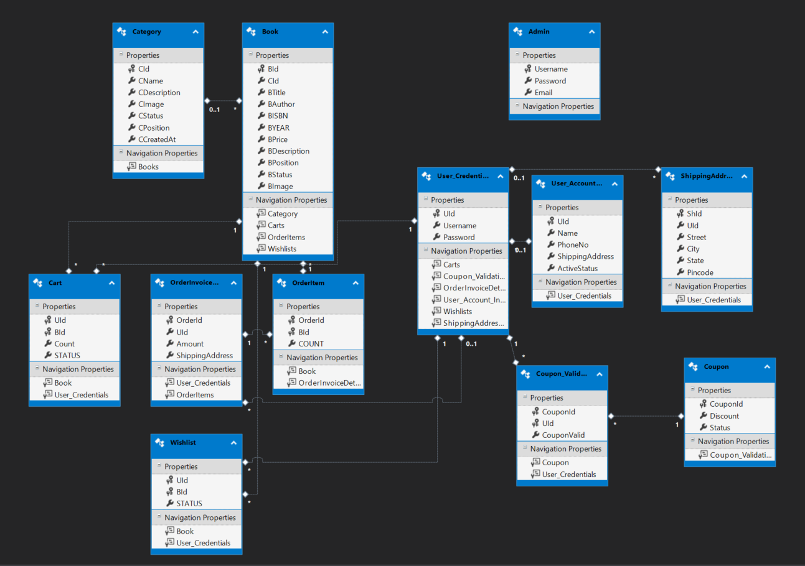

# BookStore-Backend

A collection of REST APIs built using C# .NET used to simulate a bookstore.

# Dependencies
* Entity Framework => version 6.1.3
* Microsoft.AspNet.WebApi.Cors => version 5.2.7  
* Microsoft.Owin.Host.SystemWeb => version 4.2.0 
* Microsoft.Owin.Security.OAuth => Version 4.2.0 
* Microsoft.Owin.Cors => version 4.2.0 
* Newtonsoft.json => version 13.0.1

# Running the application locally
* git clone -b branch-name https://github.com/Nami2012/BookStore-Backend.git  
* Open .sln file  
* right click on Solution > Manage NUGet Packages > Restore  
* right click on Solution > Clean Solution ,   
* Change Data Source in Connection String in Web.config  
* Close and relaunch vs  
* right click on Solution > Build Solution  
* Close Visual Studio and re-open.  
* Rebuild solution. 
If these steps don't initially resolve your issue try repeating the steps a second time.   

# Features
* View books according to category
* Category sorted according to position
* Avail discounts using coupons
* Search for books using various filters ( Category, ISBN, Author, Book Title)
* Activation or Deactivation of books from Admin Panel
* Full fledged admin panel for management of users, categories and books.

# Database Design

# Functionalities
* Bookstore Visitors
  * View Books
  * View Categories
  * Search for Books and apply filters
* Bookstore Account Holders 
  * Avail all functionality of visitors
  * Add/Remove book to/from cart
  * Change the quantity of books from cart
  * Add/Remove book to/from Wishlist
  * Add/edit/choose shipping Addresses 
  * Edit user details
  * Apply coupon of their wish before placing the order
  
* Bookstore Admin
  * Avail all functionality of visitors
  * Change user details - includes activating or deactivating or deleting them
  * Add/edit/activate/deactivate/delete books and category
  * Add/edit/activate/deactivate coupons

# Points of Discussion
* Entity framework vs ADO.net which one to choose
* DB Design 
* Basic Auth vs Token Based Authentication

# Key Errors Encountered
* Multiple header and empty header CORS Issue resolution

# Further steps
* Introduce Layering
* Database Logging
